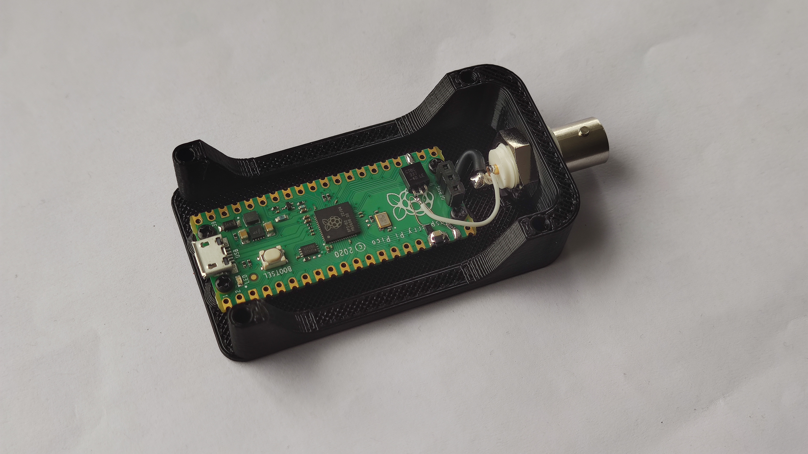

# red-button-trigger-timestamp 🔘 for Raspberry Pi Pico

This device allows using a Raspberry Pi Pico board to capture accurate timing
information at the time an external trigger fired. We use it with
[FLO](https://github.com/strawlab/flo) to log when exactly our high speed
cameras were triggered.

Directories:

- `firmware` - source code for the firmware to be flashed on the Raspberry Pi Pico
- `red-button-trigger-timestamp` - source code for the command-line program
  running on a host PC which talks to the Pico and writes a `.csv` file with the
  trigger timestamps
- `red-button-trigger-timestamp-comms` - source code defining messages types passed between the Pico and the host PC
- `hardware` - schematic and 3d-printed enclosure
